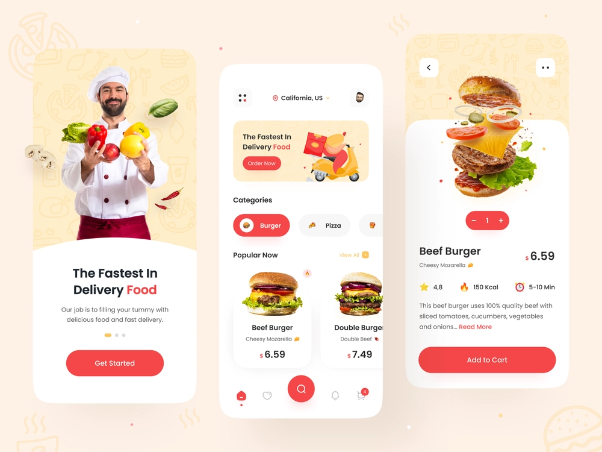

<h1 align="center">
Food Delivery App
</h1>

<br>
<p align="center">
  
</p>
<br>

# Projeto

O projeto foi construindo a partir do seguinte template: <a>https://dribbble.com/shots/15432999-Food-Delivery-App</a>

# Configurações

Antes de rodar o projeto, verifique a versão do Google Services do seu emulador e as seguintes configurações:

- https://firebase.google.com/docs/android/setup?hl=pt-br
- https://developer.android.com/jetpack/androidx/migrate?hl=pt-br
- https://developer.android.com/studio/build/multidex?hl=pt-BR

# Clone e execute

Para clonar e executar esse app você precisará do [Git][git] + [Dart][dart] + [Flutter][flutter] instalados no seu computador.

```bash
# Clone esse repositório
$ git clone https://github.com/LeandroSimo/food_delivey_app.git

# Entre no repositório
$ cd food_delivey_app

# Instale as dependências
$ flutter pub get

# Execute
$ flutter run

```

[git]: https://git-scm.com
[flutter]: https://flutter.dev/
[dart]: https://dart.dev/
